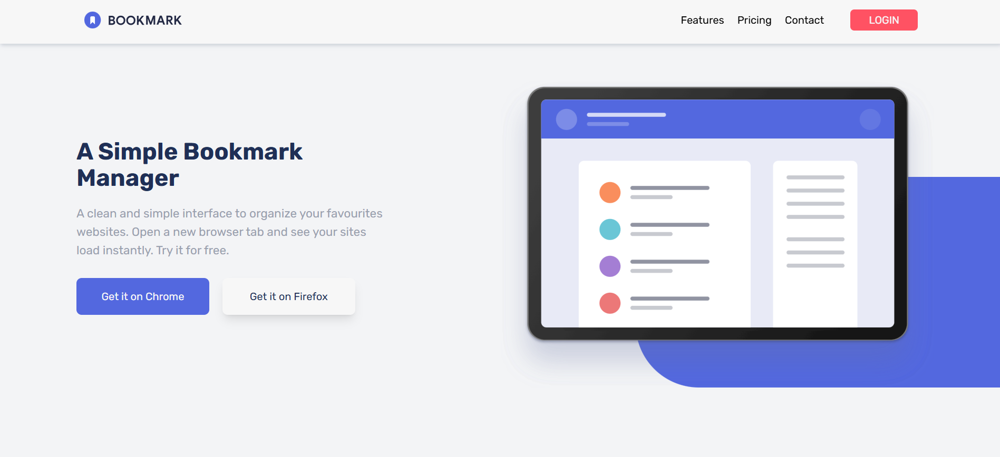

# Frontend Mentor - Bookmark landing page solution

This is a solution to the [Bookmark landing page challenge on Frontend Mentor](https://www.frontendmentor.io/challenges/bookmark-landing-page-5d0b588a9edda32581d29158). Frontend Mentor challenges help you improve your coding skills by building realistic projects. 

## Table of contents

- [Overview](#overview)
  - [The challenge](#the-challenge)
  - [Screenshot](#screenshot)
  - [Links](#links)
- [My process](#my-process)
  - [Built with](#built-with)
  - [What I learned](#what-i-learned)
  - [Continued development](#continued-development)
  - [Useful resources](#useful-resources)
- [Author](#author)


## Overview

### The challenge

Users should be able to:

- View the optimal layout for the site depending on their device's screen size
- See hover states for all interactive elements on the page
- Receive an error message when the newsletter form is submitted if:
  - The input field is empty
  - The email address is not formatted correctly

### Screenshot



### Links

- Solution URL: [Github](https://github.com/Diego2Drm/bookmark-landing-page)
- Live Site URL: [Bookmark landing page master](https://diego2drm.github.io/bookmark-landing-page/)

## My process

### Built with

- Semantic HTML5 markup
- CSS custom properties
- Flexbox
- Mobile-first workflow
- [React](https://reactjs.org/) - JS library
- [Tailwind CSS v4.1](https://tailwindcss.com/docs/installation/using-vite) - For styles

### What I learned

I learned to use Redux in this project.

```jsx -->store
import { legacy_createStore as createStore } from 'redux'
import { bookReducer } from './reducers/index.js'
import { Provider } from 'react-redux'

const store = createStore(bookReducer);

createRoot(document.getElementById('root')).render(
  <StrictMode>
    <Provider store={store}>
      <App />
    </Provider>
  </StrictMode>,
)

```
```js --> reducers
import { featuresData } from "../components/utils/FeaturesData"
import { SET_ACTIVEDATA, SET_EMAIL, SET_ERROR, SET_ISOPEN, SET_ISOPENINDEX } from "../actions/types";

const initialState = {
  isOpen: false,
  activeData: featuresData[0],
  isOpenIndex: null,
  email: '',
  error: false,
}

export const bookReducer = (state = initialState, action) => {
  switch (action.type) {
    case SET_ISOPEN:
      return { ...state, isOpen: action.payload }
    case SET_ACTIVEDATA:
      return { ...state, activeData: action.payload }
    case SET_ISOPENINDEX:
      return { ...state, isOpenIndex: action.payload }
    case SET_EMAIL:
      return { ...state, email: action.payload }
    case SET_ERROR:
      return { ...state, error: action.payload }
    default:
      return state
  }
}
```
```js --> action
import { SET_ACTIVEDATA, SET_EMAIL, SET_ERROR, SET_ISOPEN, SET_ISOPENINDEX } from "./types";

export const setIsOpen = (payload) => ({
  type: SET_ISOPEN,
  payload
})

export const setActiveData = (payload) => ({
  type: SET_ACTIVEDATA,
  payload
})

export const setIsOpenIndex = (payload) => ({
  type: SET_ISOPENINDEX,
  payload
})

export const setEmail =  (payload) => ({
  type: SET_EMAIL,
  payload
})

export const setError = (payload) => ({
  type: SET_ERROR,
  payload
})
```
```js --> types
const SET_ISOPEN = "SE_ISOPEN";
const SET_ACTIVEDATA = "SET_ACTIVEDATA";
const SET_ISOPENINDEX = "SET_ISOPENINDEX";
const SET_EMAIL = "SET_EMAIL";
const SET_ERROR = "SET_ERROR";

export { SET_ISOPEN ,SET_ACTIVEDATA, SET_ISOPENINDEX, SET_EMAIL, SET_ERROR };
```


### Continued development

I will continue learning Redux through its documentation and available tutorials, and then I will learn Redux Toolkit.

### Useful resources

- [Redux](https://redux.js.org/introduction/getting-started) - This helped me learn Redux.

## Author

- Website - [Diego Ramírez](https://diego2drm.github.io/Portafolio/)
- Frontend Mentor - [@Diego2Drm](https://www.frontendmentor.io/profile/Diego2Drm)
- Gmail - [diego.ramirez2d03@gmail.com]

